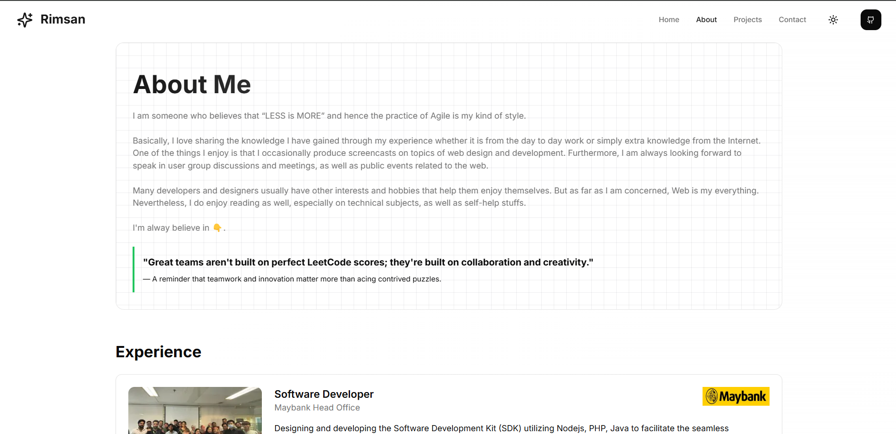
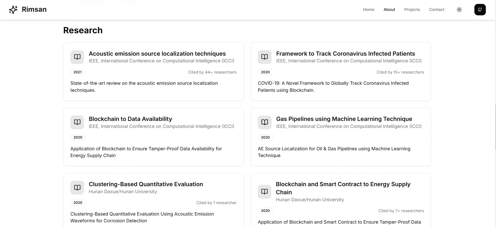
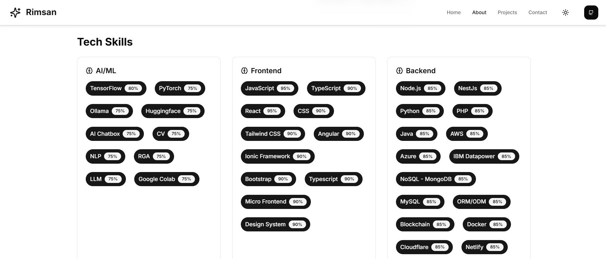
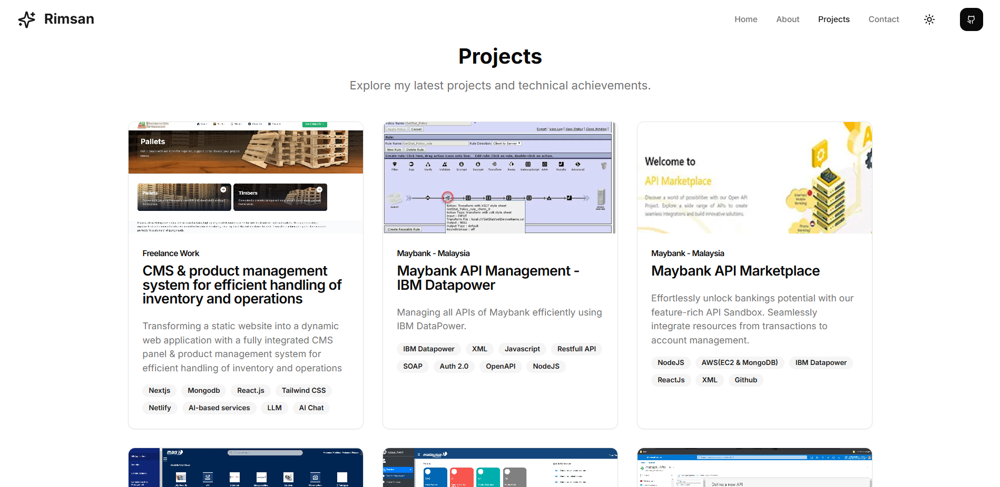

<div>
<div align="center">
    <a href="https://www.rimsan.me/">
        
    </a>

    ## ⭐🌐🔍💼🛠️📈🎯📬

    ### Interactive Resume AI Assistant Portfolio.
</div>

</div>

<!-- Add badges here -->
<div align="center">
  <a href="https://nextjs.org" title="Visit Next.js" target="_blank">
    
  </a>
  <a href="https://typescriptlang.org" title="More Typescript" target="_blank">
    
  </a>
</div>

---

<div>
# 👋 AI-Powered Portfolio Experience

Experience a new way of exploring professional portfolios. Chat with an AI that knows every detail about my experience and skills.

🌐 [Visit demo Portfolio](https://www.rimsan.me)  

---

## 🔍 About Me  

The About Page serves as a comprehensive section to present detailed insights into your professional journey, technical expertise, and noteworthy contributions to your field. Designed with a clean and organized layout, it ensures easy navigation and highlights the key aspects of your profile effectively:  

- **Experiences**: This section provides a chronological account of your professional journey.  
- **Tech Skills**: Highlights your technical proficiency and software expertise.  
- **Researches**: Showcases your contributions to research or published works.  

    
     
     
---


## 📈 Projects  

A Projects Page is a critical element of a professional portfolio, especially for software engineers and developers. Here's how you can structure it effectively::  

- **Title and Overview**: A catchy title and a short, engaging description of the project.  
- **Technologies Used**: Icons or a list of technologies/frameworks used (e.g., HTML, CSS, JavaScript, React, Node.js, etc.). 

 


## 🎯 Goals  

Goals is an open-source web application designed to showcase your professional resume in an interactive and user-friendly way. Users can explore your work experiences, skills, publications, projects, and even interact with a chatbot to learn more about you.

## Features and Functionalities

### 1. Overview Dashboard
- A clean and modern landing page with a brief introduction about you.
- Highlight your tagline or mission statement.

### 2. Interactive Resume Sections
- **Work Experiences**: Add job titles, companies, duration, and key achievements.
- **Tech Skills**: Showcase skills categorized by proficiency (e.g., beginner, intermediate, expert).
- **Publications/Researches**: List papers, journals, or blog posts with links.
- **Projects**: Provide project descriptions, tech stack used, and links to demos or GitHub repositories.
- **Achievements**: Highlight awards, recognitions, and certifications.

### 3. Chatbot Integration
- A chatbot that users can interact with to learn about specific sections (e.g., "Tell me about your projects").
- Provide quick answers to frequently asked questions.

### 4. Dynamic Elements
- Downloadable PDF version of your resume.
- Embedded videos or galleries for project showcases.
- Real-time visitor analytics for feedback on popular sections.

### 5. SEO and Accessibility
- Optimize for search engines using structured data.
- Ensure accessibility standards for users with disabilities.

## Tech Stack

### Frontend
- **React.js/Next.js**: For building an interactive UI.
- **Tailwind CSS/Bootstrap**: For styling.
- **Three.js**: Add 3D elements for visual appeal (optional).

### Backend
- **Node.js with Express**: For API services.
- **Firebase/Supabase**: For real-time database and authentication.

### Database
- **MongoDB**: Store structured resume data.
- **PostgreSQL**: For relational data like user feedback.

### Deployment
- **Vercel/Netlify**: For easy CI/CD integration.
- **GitHub Pages**: If aiming for simpler hosting.

## Additional Enhancements
- **Theme Customization**: Allow users to choose between light and dark themes.
- **Language Support**: Multi-language capabilities for broader reach.
- **Collaboration**: Let users clone the project and easily modify it for their resumes.

## Open-Source Guidelines
- Provide a detailed **README.md**: Include setup instructions, contribution guidelines, and license details.
- Use GitHub issues and pull requests for collaboration.
- Add a demo link or host a sample version of the application.

---
# Project Name

## Installation

### 1. Clone the Repository

First, clone the repository to your local machine:

```bash
git clone <repository_url>
cd <project_name>
npm install
```

### 2. Environment Variables Configuration

Create a .env file at the root of your project and add the following values:

```bash
# Azure OpenAI Configuration
AZURE_OPENAI_ENDPOINT=<your_azure_openai_endpoint>
AZURE_OPENAI_API_KEY=<your_azure_openai_api_key>
AZURE_OPENAI_MODEL=gpt-35-turbo-portfolio

# Google Analytics
NEXT_PUBLIC_GOOGLE_ANALYTICS=<your_google_analytics_tracking_id>
```
Make sure to replace the placeholders with your actual credentials.

### 3. Centralized Data in /lib/data.ts

You can centralize your configuration data into a single file. Here's an example for /lib/data.ts:

```bash
export const resumeData=`
    Add your resume content here...
`;
```

### 4. To Run

You can check on local server http://localhost:3000

```bash
npm run dev
```

---

## 📬 Let’s Connect  

- 📧 Email: [rimsnet@gmail.com](mailto:rimsnet@gmail.com)  
- 🔗 LinkedIn: [linkedin.com/in/rimzan](https://www.linkedin.com/in/rimzan)  

---

⭐ **Star, Fork, and Watch** my repositories to stay updated with my latest works!  

</div>